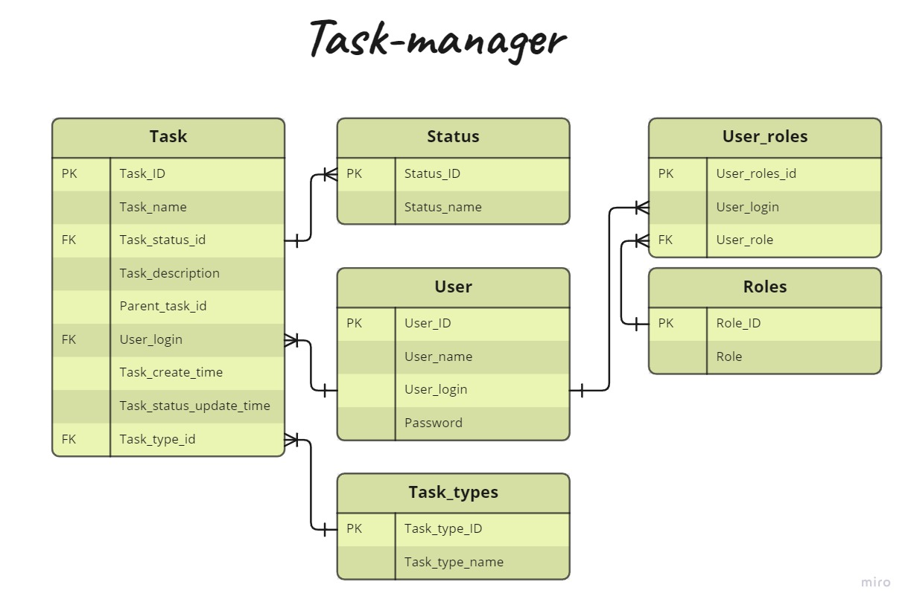

# task-manager
В приложении осуществлен доступ и редактирование иерархической структуры проектов и задач, входящих в них.
Проект по сути является родительской сущностью для всех подзадач, входящих в него.  У каждой задачи может быть неограниченное
количество подзадач (подпроектов). У проекта родителя нет. У каждой задачи есть исполнитель, каждая задача может быть либо для технического
специалиста, либо для менеджера. Любой пользователь может создать задачу, изменить статус своей задачи, удалить свою задачу,
посмотреть все задачи. Если пользователь является администратором, то он также может изменить описание задач и удалить любую задачу.
Структура представлена на следующей ER-диаграмме:



База данных изначально хранит двух пользователей с соответствующими ролями и паролями:
{user, password} и {admin, password}.
Логика авторизации прописана в публичном классе SecurityConfiguration. В учебных целях, для облегчения восприятия
отсутствует шифровка пароля.
К таблицам User, Task и TaskType созданы соответствующие сущности. Доступ и наполнение таблиц производится через dao 
посредством JDBC.
Отправка PUT-, и POST-запросов производится с JSON запросом, например, следующий POST-запрос отправленный по эндпоинту
http://localhost:8080/users:
```json
{
"userName": "Винни Пух",
"login": "vinny",
"password": "password",
"roleId": 1
}
```
создает в базе пользователя с логином vinny, паролем password и ролью 1, которая соответствует ROLE_ADMIN:
```json
{
  "id": 3,
  "userName": "Винни Пух",
  "login": "vinny",
  "password": "password",
  "roleId": 1,
  "role": "ROLE_ADMIN"
}
```
POST-запрос, отправленный по эндпоинту
http://localhost:8080/project:
```json
{
  "name": "Первый проект",
  "description": "Описание первого проекта",
  "taskType": { "id": 1}
}
```

создает в базе проект (данное действие может совершить только пользователь с ролью ROLE_ADMIN), с типом задачи для
менеджера (в таблице тип 1):

```json
{
  "id": 1,
  "name": "Первый проект",
  "status": "NEW",
  "description": "Описание первого проекта",
  "parentId": 0,
  "login": "admin",
  "createTime": "2023-03-14T11:37:53.624623",
  "updateTime": "2023-03-14T11:37:53.624623",
  "subTask": [],
  "taskType": {
    "id": 1,
    "name": "Менеджер"
  }
}
```
POST-запрос, отправленный по эндпоинту
http://localhost:8080/project/task/2:

```json
{
  "name": "Первая задача первого проекта",
  "description": "Описание первой задачи",
  "taskType": { "id": 2}
}
```
добавит в базу задачу, данный запрос может выполнить пользователь с ролью USER_ROLE:
```json
{
  "id": 2,
  "name": "Первая задача первого проекта",
  "status": "NEW",
  "description": "Описание первой задачи",
  "parentId": 1,
  "login": "user",
  "createTime": "2023-03-14T12:04:24.933214",
  "updateTime": "2023-03-14T12:04:24.933214",
  "subTask": [],
  "taskType": {
    "id": 2,
    "name": "Технический специалист"
  }
}
```

GET-запрос отправленный по адресу (доступно для обеих ролей) http://localhost:8080/project вернет общую структуру:
```json
  {
    "id": 1,
    "name": "Первый проект",
    "status": "NEW",
    "description": "Описание первого проекта",
    "parentId": 0,
    "login": "admin",
    "createTime": "2023-03-14T12:04:20.799247",
    "updateTime": "2023-03-14T12:04:20.799247",
    "subTask": [
      {
        "id": 2,
        "name": "Первая задача первого проекта",
        "status": "NEW",
        "description": "Описание первой задачи",
        "parentId": 1,
        "login": "user",
        "createTime": "2023-03-14T12:04:24.933214",
        "updateTime": "2023-03-14T12:04:24.933214",
        "subTask": [],
        "taskType": {
          "id": 2,
          "name": "Технический специалист"
        }
      }
    ],
    "taskType": {
      "id": 1,
      "name": "Менеджер"
    }
  }
```

PUT-запрос, отправленный на эндпоинт http://localhost:8080/project позволит редактировать задачи:
```json
{
  "id": 1,
  "name": "Первый проект изменено",
  "status": "IN_PROGRESS",
  "description": "Описание первого проекта изменено"
}
```
User может редактировать только статус своей задачи, Admin может менять название, статус, описание и перназначать 
пользователя у любой задачи или проекта.
DELETE-запрос http://localhost:8080/project/{id}, где id - идентификатор задачи или проекта, позволяет удалить задачу 
(User может удалить только свои задачи, Admin может удалить любую задачу.)

Ознакомиться со всеми запросами можно в приложенных коллекциях для Postman. После прохождения одной коллекции сделать
перезапуск приложения.
